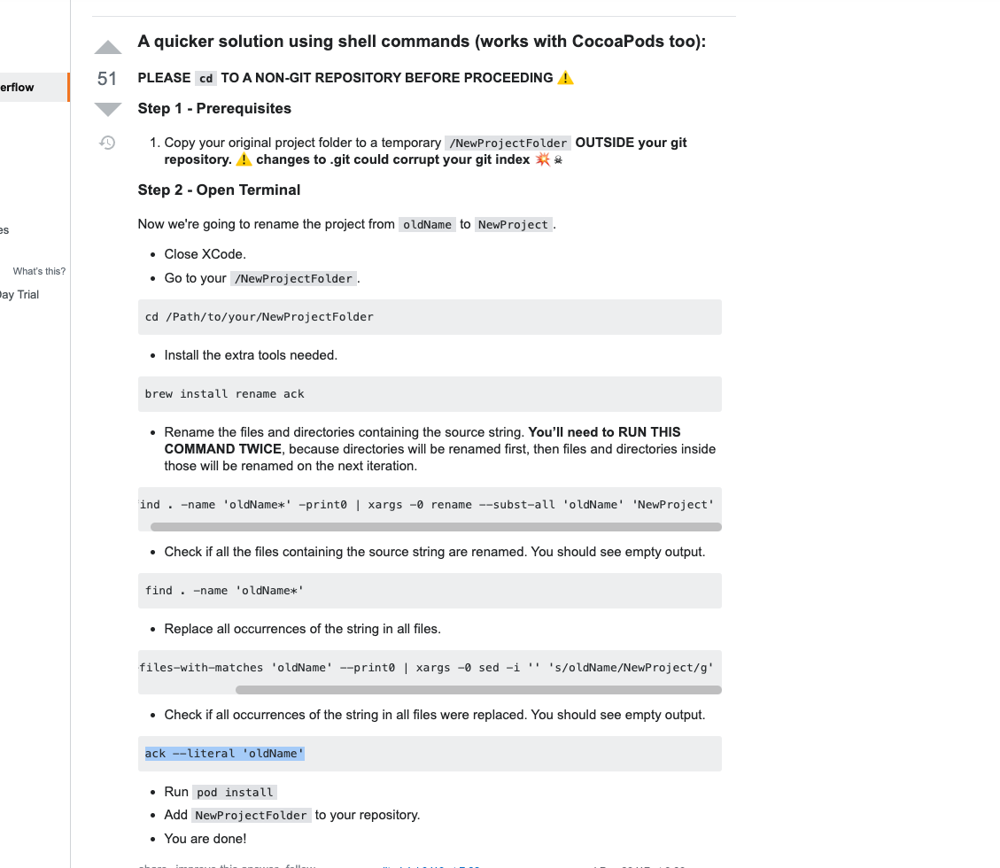

## Includes

- React-native 0.62
- React-Navigation v5
- easy-peasy for state management
- redux-persist for data persistence
- Reactotron and Flipper for debugging
- React Native UI Kitten for UI Library and Theming (eva design)
- Theming using hooks!
- Built in Authentication Flow
- Built in 60fps Animated Tab Bar
- Unit tests

## Getting Started

**Step 1:** Clone and Install

```sh

$ git clone https://github.com/chris24elias/react-native-app-template.git

$ cd react-native-app-template

$ rm -rf ./.git

$ yarn

```

**Step 2:** Rename the app [react-native-rename](https://github.com/junedomingo/react-native-rename#installation)

```sh

$ yarn global add react-native-rename

$ react-native-rename <newName>

```

**Step 3:** Rename XCode Project Completely



https://stackoverflow.com/questions/33370175/how-do-i-completely-rename-an-xcode-project-i-e-inclusive-of-folders
